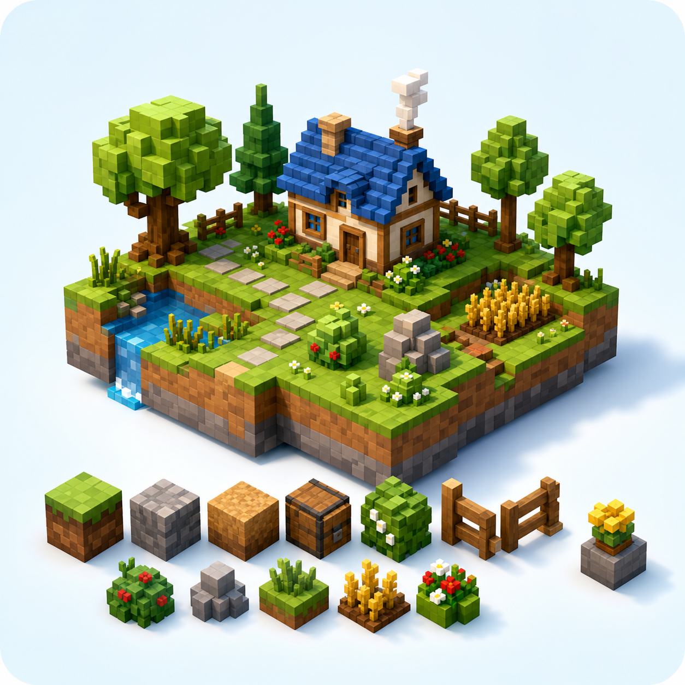
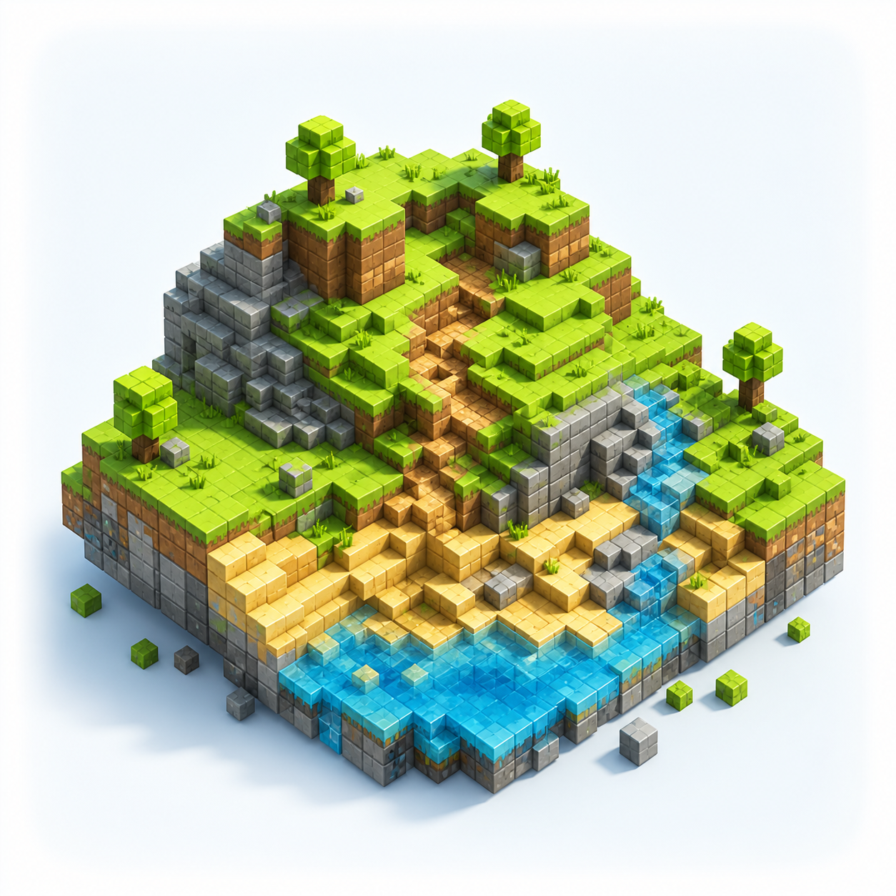
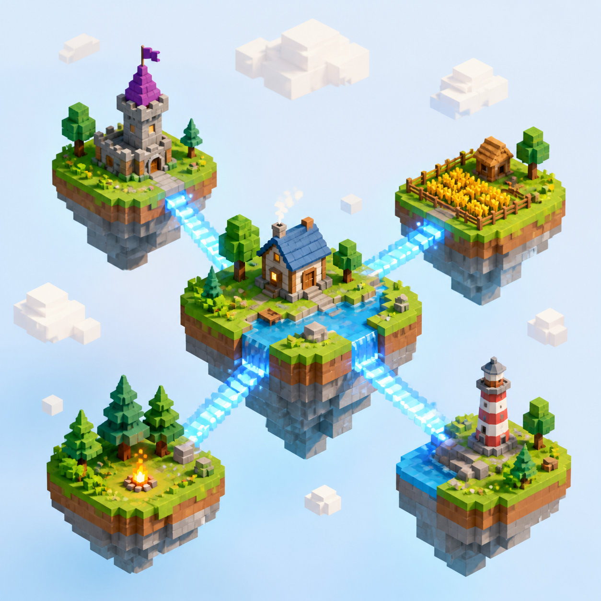

# Tiny World Builder

[](https://github.com/jasonkneen/tiny-world-builder/stargazers)


A self-contained 3D voxel world editor in the browser: build, sculpt, fly
through, and share tiny worlds.

| Build | Fly |
| --- | --- |
|  |  |
| Place terrain, props, homes, paths, crops, and animals. | Switch camera modes and explore from every angle. |

| Sculpt | Share |
| --- | --- |
|  |  |
| Raise, lower, paint, and tune the ground into cliffs and rivers. | Save, remix, export, and open worlds to real players. |

## Running locally

```bash
npm run dev
# serves http://localhost:3000/
# builder lives at http://localhost:3000/tiny-world-builder
# use another port with: npm run dev -- 3001

# or open the static file directly (no dev server)
open index.html
```

## Deploy

The app deploys as a static site on Vercel or Netlify. Both host configs run
`./publish.sh` and serve the generated `dist/` directory. The root
`index.html` is the landing page, and the builder stays available at
`/tiny-world-builder.html` and `/tiny-world-builder`. Three.js r128 and
GLTFLoader are self-hosted from `vendor/three/` so deploys do not depend on
runtime CDNs.

```bash
npm test
npm run build

# Vercel
vercel deploy

# Netlify
netlify deploy --build
# or connect the repo in Netlify; netlify.toml supplies build/publish settings
```

## Account Auth

Netlify Identity remains the email/OAuth account provider. Phantom wallet login
uses the same account APIs after the wallet signs a server challenge, then the
function returns a signed wallet session bearer token. Set
`TINYWORLD_WALLET_SESSION_SECRET` in Netlify before enabling wallet login in a
real deploy.

## Controls

| Action            | Input                                  |
| ----------------- | -------------------------------------- |
| Place             | click a cell                           |
| Erase             | `E` then click, or pick the eraser     |
| Orbit             | drag                                   |
| Zoom              | scroll wheel                           |
| Stack/enhance item | click the same object tool on an existing object (max 8) |
| Raise/lower terrain | `R` / `F` over the hovered cell      |
| Switch tool       | `1`–`9`, then letter shortcuts shown in the toolbar |
| Back to Select    | `Esc` (disarms any build/paint/erase tool)          |
| Toggle camera     | `P` or `I` (isometric ⇄ soft ⇄ perspective) |
| Reset to preset   | reset button                           |
| Clear to grass    | `C`                                    |

## Vehicle runtime (Road AI)

Shareable seeded demo:

```text
http://localhost:3000/tiny-world-builder?demo=vehicles&seed=tide-ridge-428
```

Large-scale route stress URL:

```text
http://localhost:3000/tiny-world-builder?demo=vehicles-large&seed=metro-culdesac-20&stats=1
```

Large demo URL params:

- `size=` / `mapSize=` / `grid=` / `gridSize=` — rounded to the nearest valid demo grid size from `12` through `20` (`12`, `16`, `20`).
- `cars=` / `carCount=` / `vehicles=` / `vehicleCount=` — clamped to `1..120` and capped by available unique route endpoints.

Example:

```text
http://localhost:3000/tiny-world-builder?demo=vehicles-large&seed=ridge-loop-917&size=20&cars=18&stats=1
```

The large route defaults to a deterministic 20×20 map with arterial roads,
ring roads, bridge crossings, cul-de-sac endpoints, and 36 runtime vehicles
retargeting through long paths. Use it for route planner / traffic scale checks;
the default bare-port redirect still opens the smaller watchable demo.

Loading either URL creates the map, places delivery bots, assigns targets, and starts
vehicles driving. The seed is deterministic; change the `seed=` value to get the
same road layout with different deterministic scenery.

You can also drive runtime vehicles through the same relay/API path used by `send-command.js`.

- `vehicle-spawn --x <n> --z <n> --mode auto|manual --goalX <n> --goalZ <n>`
- `vehicle-goal --id <id> --x <n> --z <n>`
- `vehicle-controls --id <id> [--forward] [--reverse] [--left] [--right]`
- `vehicle-remove --id <id|all>`
- `vehicle-clear`

Vehicles only move on `path` cells (or bridge cells used as road bridges). Placed objects on paths become live traffic blockers, so dropping a rock/tree/house/fence onto a road makes active cars reroute around that cell or stop if no alternate path exists. Runtime traffic checks also keep cars from passing through each other: vehicles brake/yield inside the collision envelope and, when blocked long enough, reroute around occupied road cells if the network has an alternate path.

For live telemetry in the browser console:

```js
window.__getVehicleRuntimeSnapshot()
```

## Tools

`Grass` · `Path` · `Dirt` · `Water` · `Stone` · `Lava` · `Sand` · `Snow` ·
`House` · `Tree` · `Fence` · `Rock` · `Bridge` · `Crop` · `Corn` · `Wheat` ·
`Pumpkin` · `Carrot` · `Sunflower` · `Tuft` · `Flower` · `Bush` · `Cow` ·
`Sheep` · `Erase`.

Terrain/object rules are normalized by the renderer: crops force dirt
underneath, bridges force water, and ordinary objects do not float on water.
Paths, shorelines, water foam, bridges, fences, castle walls, houses, and
rocks are adjacency-aware — placing a neighbor re-renders surrounding cells
so roads join, rivers get banks, bridge direction updates, fence walls connect,
house clusters form L/T/+/square buildings, and rock cells grow into craggy
outcrops.

## Architecture

Single `<script>` block, currently ~29k lines of vanilla JS, organised by section
comments (`// -------- xyz --------`). The model is split cleanly:

- **`world[x][z]`** — intent: `{ terrain, kind, floors }` per cell.
- **`cellMeshes['x,z']`** — rendered Three.js groups for each cell.
- **`setCell(x, z, opts)`** — single mutation entry point. Updates `world`,
  rebuilds the cell's tile/object meshes, and re-renders any neighbors that
  care about adjacency (fence/house clusters).

House clusters use BFS (`bfsHouseCluster`) plus `tryComposite` (L/T/+) and
`trySquare` to decide whether a group of house cells should render as a
unified structure or stretched rectangles.

A shared `dropAnims` queue ease-outs new tiles/objects into place. Other
per-frame animations (tree sway, crop bob, smoke origin) check
`obj.userData.landing` so they yield while a piece is still falling in.

Newer systems are still routed through that same contract:

- **Preview boards** lazily generate surrounding boards as the camera pans; preview distance/window/opacity settings auto-scale from board size but remain user-adjustable.
- **AI generation / Auto** validate sparse v4 worlds against the embedded schema.
- **Local world slots** keep multiple named saves in browser storage.
- **Weather, time, clouds, and crop duster** are decorative scene systems layered on the same renderer.
- **Command palette** indexes tools, views, settings, and terrain raise/lower actions.
- **Mesh Terrain sculptor** (the "Mesh Terrain" toggle, right edge) is an opt-in
  voxel-block landscape designer: lay a fine voxel grid over the whole board,
  paint per-voxel materials (grass/sand/water/stone/dirt/snow/lava), then grab
  the surface and pull voxels up/down. Each voxel keeps a **flat top** at its own
  height with vertical step-walls between neighbours, so the result reads as
  small flat-topped blocks depicting the layout (not a smooth/curved surface).
  Pulling one voxel up drags its neighbours up too with a smoothstep "tension"
  falloff. **Apply** keeps the block mesh as the rendered terrain (hiding the
  flat home tiles) rather than baking back into per-tile terrain. Runtime
  placement, selection highlights, vehicles, crowds, and Tinyverse avatars can
  sample the block surface for grounding; state still lives under its own
  `tinyworld:meshTerrain:*` localStorage keys and the world schema is unchanged.

## Validation

```bash
npm test        # syntax, schema parity, local assets, static smoke checks
npm run build   # publish checks + dist generation
```

Manual browser smoke checklist after visual changes: page loads with no console
errors; place/erase works; `C`, `P`/`I`, `R`/`F`, and tool shortcuts respond;
fence neighbors update; cloud shadow at 0% still leaves visible clouds.

See [AGENTS.md](./AGENTS.md) for guidance on extending the codebase.

## Star History

If Tiny World Builder is useful to you, a star helps other builders find it.

[](https://star-history.com/#jasonkneen/tiny-world-builder&Date)

## Files

```
tiny-world-builder.html          the app
README.md                        this file
AGENTS.md                        guidance for AI coding agents
world.schema.json                import/export schema mirrored into the app
tools/check.js                   static syntax/schema/asset check
tools/smoke-static.js            no-browser smoke guard for key app contracts
vendor/three/                    self-hosted Three.js r128 runtime files
```
